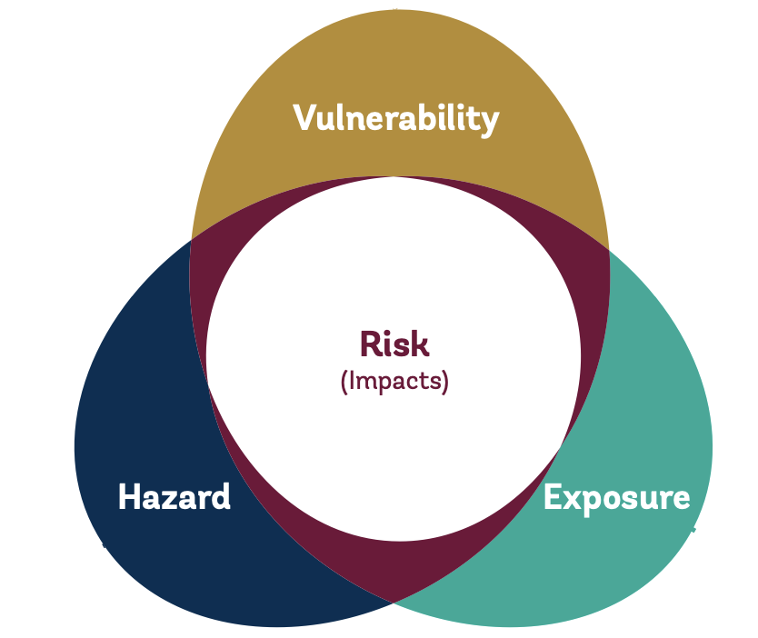

# Summary

This page summarizes the method used to estimate the population at high risk from climate-related hazards Vision Indicator. The methodology adopts a widely used framework to assess risk in the context of climate change impacts. Risk is the potential for adverse consequences. Risks result from interactions between climate-related **hazards** with the **exposure** and **vulnerability** of the affected population to the hazards. 

The hazard is the potential occurrence of a physical event that may cause welfare impacts. Exposure is the presence of people in places that could be adversely affected. Vulnerability is the propensity or predisposition of these people to be adversely affected, or unable to cope with impacts. 

**People at high risk from climate-related hazards** are defined as those exposed to any hazard and vulnerable on any dimension, based on specific thresholds. 

**Exposure** to four climate-related hazards is considered: 
| Hazard               | Return period  | Intensity threshold defining an exposed location |
|----------------------|----------------|---------------------------------------------------|
| Agricultural drought | 40 years1      | > 30% cropland or pasture affected and rural  |
| Flood                | 100 years2      | > 0.5 m inundation depth                          |
| Heatwave             | 100 years2      | > 33°C 5-day maximum Environmental Stress Index   |
| Tropical cyclone     | 100 years2      | ≥ Category 2 wind speed                           |

1 - historical frequency based on 39 years of observations.
2 - probabilistic model.

**Vulnerability** is assessed on seven dimensions:
| Dimension                      | Threshold defining a vulnerable household                         |
|--------------------------------|--------------------------------------------------------------------|
| Income                         | Less than $2.15 (2017 PPP) per person per day                      |
| Education                      | No member has completed primary education                          |
| Access to finance              | No member has a bank or mobile money account                                    |
| Access to social protection    | Does not benefit or contribute to a social protection program     |
| Access to drinking water       | No access to improved drinking water                               |
| Access to electricity          | No access to electricity                                           |
| Access to services and markets | More than 2km from an all-season road and rural                    |

Five steps to calculate the indicator are summarized below. The following chapters provide more detail.

### Step 1: [Acquiring hazard, population and vulnerability data](1_data)

Data from several sources are required to calculate the indicator. Global gridded spatial data is used to determine who is exposed in [Step 2](2_exposure). These data sets indicate the [probability and intensity of each hazard]() in a given location (grid cell), [the number of people]() living there, and the [degree of urbanization](). Vulnerability is assessed in [Step 3](3_vulnerability) primarily using [household survey data]() - in most cases the same [surveys used by the World Bank to measure poverty](https://datanalytics.worldbank.org/PIP-Methodology/acquiring.html#selection). Access to services and markets is quantified using [gridded data depicting the Rural Access Index (RAI)](). Lastly, spatial data mapping the [boundaries for statistical regions represented in surveys]() is used to merge the gridded exposure and survey-based vulnerability data in [Step 4](4_risk).

### Step 2: [Determining who is exposed](2_exposure)

The exposed population is estimated by combining global gridded population, degree of urbanization and hazard data. The hazard and degree of urbanization data is resampled so that grid cells align with the high resolution population data (approximately 90 m). Each of the 90 billion population grid cells covering the globe is categorized by exposure to any combination of the four hazards, and by eight degree of urbanization categories. As a result, the global population is assigned to one of 128 possible exposure-urbanization categories at a very fine spatial scale. 

### Step 3: [Determining who is vulnerable](3_vulnerability)

Estimating the share of households vulnerable on any dimension requires "fusing" data sources since information on all dimensions is not available from the same household survey. A [simulation method]() is used to fuse dimensions derived from other sources, such as access to social protection and finance. This preserves estimates for each population subgroup reported by alternate data sources, for example, the share of the poorest rural quintile without access to social protection. The average share of households vulnerable on any survey-based dimension across many simulations is used to calculate the indicator. 

The share of the population vulnerable on the ["access to services and markets" dimension is derived from gridded spatial data]() for each exposure category defined in [Step 2](2_exposure). This dimension is incorporated into the calculation of the final indicator in [Step 4](4_risk).

### Step 4: [Determining who is at risk](4_risk)
To determine who is at risk, the exposure estimates from [Step 2](2_exposure) are aggregated to the same level as the representative survey-based vulnerability estimates from [Step 3](3_vulnerability). This involves (1) [aggregating the population in each exposure category to survey statistical regions](); and (2) [aligning the rural/urban classifications](). With the exposure data aggregated to the same geographic and rural/urban population units as the vulnerability data, [the population exposed to any hazard and vulnerable on any dimension is calculated]().

### Step 5: [Calculating global and regional aggregates](5_aggregates)
Global and regional aggregates are calculated from the sample of countries with [sufficiently recent data for all vulnerability dimensions](). For 2021, this includes 103 countries accounting for 86 percent of the global population. Aggregates are reported only [when population coverage is sufficient]().

### Limitations
The data and methodology have important limitations. Data availability limits country coverage. Infrequent data collection means that the indicator is reported with a lag. The methodology has limitations related to the: [selection of thresholds](), [focus on direct exposure](), [fusing of vulnerability data from different sources](), and [assuming uniform vulnerability rates]() within regions with representative survey data. These are discussed in more detail [here](limitations). Quantifying the risk to people from climate-related hazards is a complex task, and the current methodology is a first step. It will be improved over time to better address limitations.
