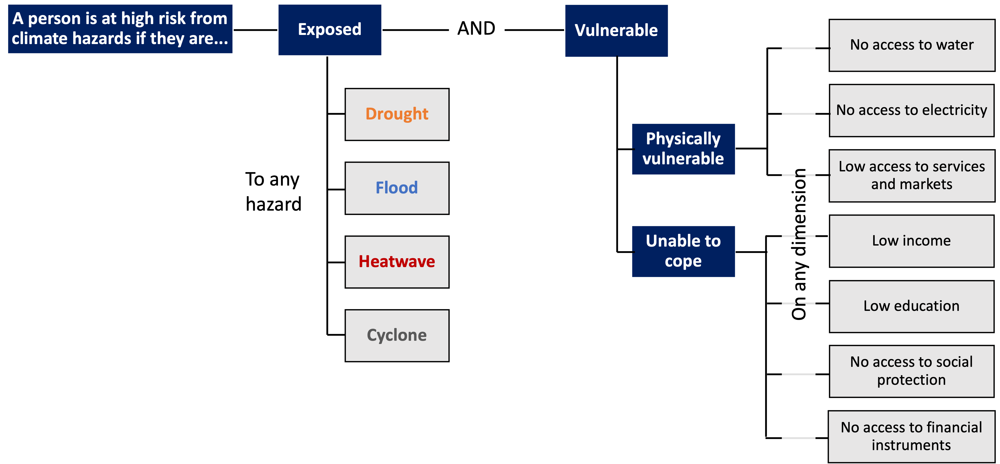

# Summary

People at high risk from climate-related hazards are defined as those exposed to any hazard and vulnerable on any dimension, based on specific thresholds. This page summarizes the methodology used to calculate the indicator in non-technical terms.

The indicator is based on a standard framework used to assess risk in the context of climate change impacts. Risks result from interactions between climate-related hazards with the exposure and vulnerability of the affected population to the hazards (IPCC, 2021). The hazard is the potential occurrence of a physical event that may cause welfare losses; exposure is the presence of people in places that could be adversely affected; and vulnerability is the propensity or predisposition of these people to be adversely affected, or unable to cope with impacts. 

The indicator currently considers a subset of hazards and vulnerability dimensions, and uses an aggregation method similar to multidimensional poverty measures. The methodology will be revised over time as new data are collected and methods are improved.

### Step 1: [Acquiring hazard, population and vulnerability data](1_data)

Different types of data from several sources are required to calculate the indicator. To determine who is exposed, "gridded" spatial data are used. These datasets indicate the probability and intensity of each type of hazard event in a given location (grid cell), the number of people living there, and the degree of urbanization. To determine who is vulnerable, socioeconomic indicators from household surveys (the same [surveys used to measure poverty](https://datanalytics.worldbank.org/PIP-Methodology/acquiring.html#selection)) and other sources are combined and then aggregated to the geographic regions and rural/urban sub-populations for which they provide representative statistics. Gridded spatial data is used for the "Access to services and markets" dimension of vulnerability. Lastly, boundary data mapping the regions represented by household surveys are required to merge the grid level exposure data and survey based vulnerability data.

### Step 2: [Determining who is exposed](2_exposure)

### Step 3: [Determining who is vulnerable](3_vulnerability)

### Step 4: [Determining who is at risk](4_risk)

### Step 5: [Calculating global and regional aggregates](5_aggregates)

## Limitations
There are... Limitations are discussed further [here](limitations).
