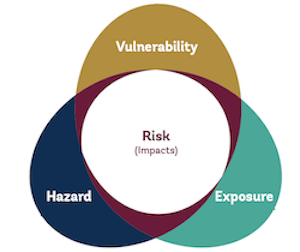

# Summary

This page summarizes the method used to calculate the Vision Indicator. The indicator methodology follows a framework often used to assess risk in the context of climate change impacts. Risks result from interactions between climate-related hazards with the exposure and vulnerability of the affected population to the hazards. 

The hazard is the potential occurrence of a physical event that may cause welfare impacts. Exposure is the presence of people in places that could be adversely affected. Vulnerability is the propensity or predisposition of these people to be adversely affected, or unable to cope with impacts. 

People at high risk from climate-related hazards are defined as those exposed to any hazard and vulnerable on any dimension, based on specific thresholds. 

**Exposure** to four climate-related hazards: 
| Hazard               | Return period  | Intensity thresholds defining exposed locations   |
|----------------------|----------------|---------------------------------------------------|
| Agricultural drought | 40^ years      | > 30% cropland or pasture affected in rural areas |
| Flood                | 100 years      | > 0.5 m inundation depth                          |
| Heatwave             | 100 years      | > 33°C 5-day maximum Environmental Stress Index   |
| Tropical cyclone     | 100 years      | > Category 2 wind speed                           |

Seven dimensions of **vulnerability**:
| Dimension                      | Thresholds defining a vulnerable household                         |
|--------------------------------|--------------------------------------------------------------------|
| Income                         | Less than $2.15 (2017 PPP) per person per day                      |
| Education                      | No member has completed primary education                          |
| Access to finance              | No bank or mobile money account                                    |
| Access to social protection    | Does not benefit nor contribute to a social protection program     |
| Access to drinking water       | No access to improved drinking water                               |
| Access to electricity          | No access to electricity                                           |
| Access to services and markets | More than 2km from an all-season road and rural                    |

The five steps to calculate the indicator are summarized below and details are provided in the following chapters. The indicator currently uses data for a subset of climate-related hazards and dimensions of vulnerability. The methodology will be revised as new data is collected and methods are improved.

### Step 1: [Acquiring hazard, population and vulnerability data](1_data)

Data from several sources are required to calculate the indicator. Global "gridded" spatial datasets are used to determine who is exposed in [Step 2](2_exposure). These indicate the probability and intensity of each type of hazard in a given location (grid cell), the number of people living there, and the degree of urbanization. Most vulnerability indicators are estimated from household survey data in [Step 3](3_vulnerability) - the same [surveys used to measure poverty](https://datanalytics.worldbank.org/PIP-Methodology/acquiring.html#selection). Gridded spatial data is used for the "access to services and markets"" dimension. Finally, boundary data mapping the geographic regions with representative survey-based estimates are required to merge gridded exposure data and survey-based vulnerability data [Step 4](4_risk).

### Step 2: [Determining who is exposed](2_exposure)

The exposed population is estimated by combining global gridded population, degree of urbanization and probabilistic hazard datasets. The data are resampled so that grid cells align with the high resolution population grid (approximately 90 m). Each population grid cell globally is categorized by exposure status to any combination of the four hazards, and by eight degree of urbanization sub-categories. As a result, the global population is assigned to one of 128 possible exposure-urbanization categories at a very fine spatial scale.

### Step 3: [Determining who is vulnerable](3_vulnerability)

Estimating the share of households vulnerable on any dimension requires "fusing" different data sources since information on all dimensions is not available in the same household survey. A simulation method is used to impute dimensions estimated from other sources, such as access to social protection and finance. This method preserves estimates for each population subgroup reported by alternate data sources, for example, the share of the poorest rural quintile without access to social protection. Random assignment of households within each population subgroup is repeated to account for household heterogeneity. The average share of households vulnerable on any (survey-based) dimension across all simulations is used to calculate the indicator. 

The share of the population vulnerable on the "access to services and markets" dimension is derived from gridded spatial data and calculated for each exposure category defined in [Step 2](2_exposure). This dimension is incorporated into the calculation of the indicator in [Step 4](4_risk).

### Step 4: [Determining who is at risk](4_risk)
To determine who is at risk, the exposure estimates from [Step 2](2_exposure) are aggregated to the representative units of the survey-based vulnerability estimates from [Step 3](3_vulnerability). This involves (1) aggregating the population by exposure category to statistical boundary data corresponding with surveys; and (2) aligning the rural/urban classifications. Once the exposure data is aggregated to the same units (subnational regions and rural/urban population groups) as the vulnerability data, the population exposed to any hazard and vulnerable on any dimension can be calculated.

### Step 5: [Calculating global and regional aggregates](5_aggregates)
Global and regional aggregates are calculated from the sample of countries with sufficiently recent data for all vulnerability dimensions. At the global level for 2021, this includes 103 countries accounting for 86 percent of the population. These aggregates are reported when population coverage is sufficient.

## Limitations
It is important to understand the limitations of the data and methodology. Data availability limits the global coverage of the indicator. Infrequent data collection means that the indicator is reported with a lag. The methodology also has limits related to the selection of thresholds, restricting the analysis to direct exposure, and assuming uniform vulnerability rates within regions with representative survey data. These are discussed in more detail [here](limitations). Quantifying risk from climate-related hazards is a complex task, and the current methodology is a first step. It will be improved over time to better address these limitations.
